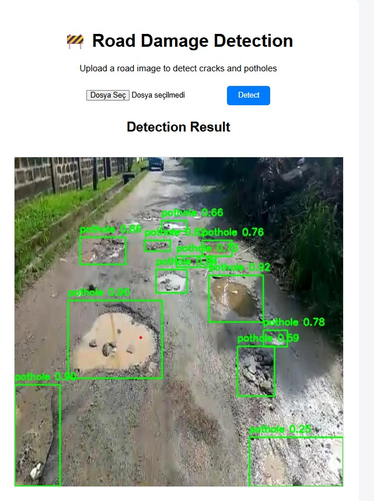
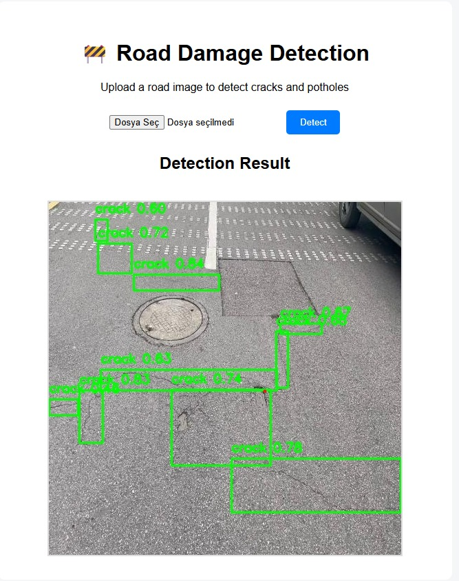
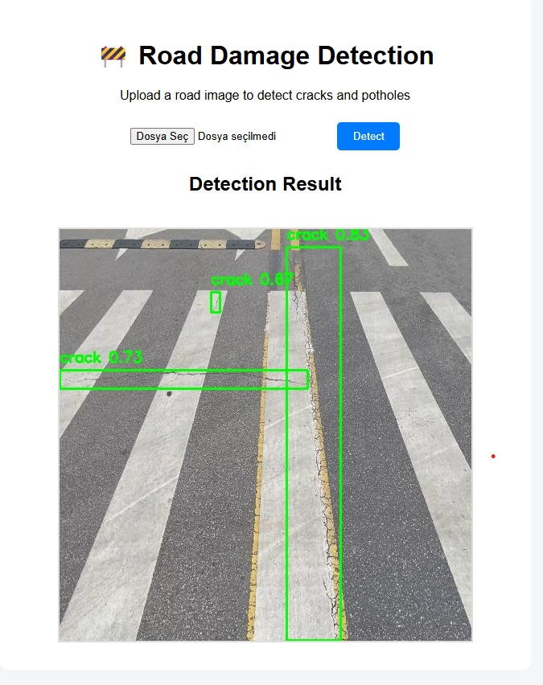
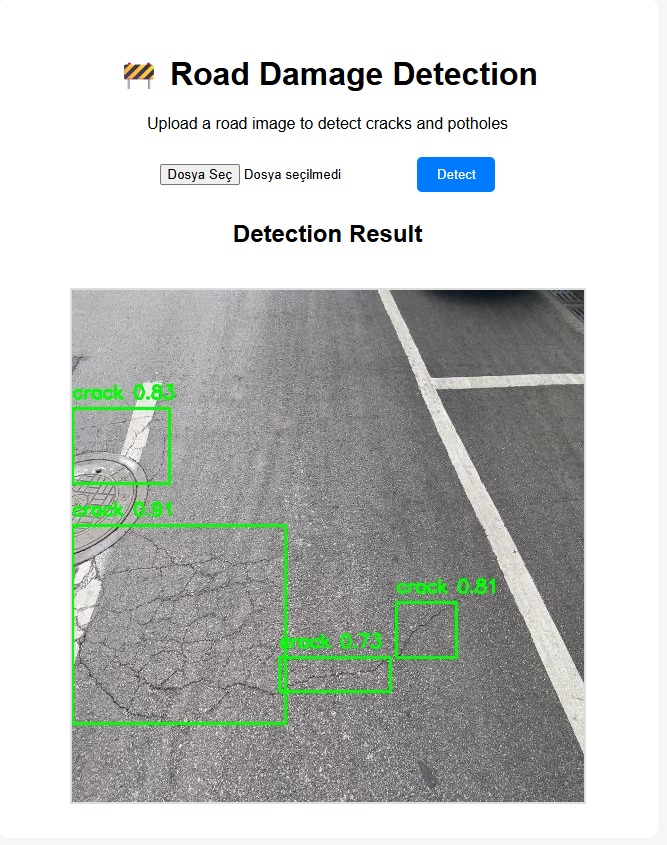

# 🚧 YOLO-Based Road Damage Detection Web Application


A web-based crack and pothole detection system built using YOLO and deployed with Flask.

This application allows users to upload road images and receive real-time detection results with bounding boxes highlighting cracks and potholes.

---

## 🚀 Project Overview

This project implements an AI-powered web application for detecting road surface damages such as:

- 🕳️ Potholes
- 🪨 Cracks

The system uses a trained YOLO model for object detection and a Flask backend to handle image uploads and inference processing.

Users can upload an image through the web interface, and the system returns the processed image with detected damages highlighted.

This project demonstrates practical AI deployment by integrating a trained deep learning model into a functional web application.

---

## 📸 Detection Results (Model Inference Examples)

The following screenshots demonstrate YOLO-based crack and pothole detection performed through the Flask web interface.

<p align="center">
  
  
</p>

<p align="center">
  
  
</p>

---

## 🏗️ System Architecture

User Upload (Web Interface)  
⬇  
Flask Backend  
⬇  
YOLO Model Inference  
⬇  
Detection Results (Bounding Boxes)  
⬇  
Processed Image Displayed  

---

## 🛠️ Tech Stack

- Python
- Flask
- YOLO
- OpenCV
- HTML / CSS

---

## 📂 Project Structure

```
crack_pothole_detection/
│
├── app.py
├── requirements.txt
├── model/
│   └── best.pt
├── utils/
│   └── detector.py
├── templates/
├── static/
│   └── results/
└── README.md
```

---

## ⚙️ Installation & Setup

### 1️⃣ Install Dependencies

```bash
pip install -r requirements.txt
```

### 2️⃣ Run the Application

```bash
python app.py
```

The web app will start on:

```
http://127.0.0.1:5000/
```

---

## 🎯 Features

- Image upload via web interface
- YOLO-based crack and pothole detection
- Bounding box visualization
- Processed result rendering
- Simple and clean Flask deployment
- Confidence score display for detected objects

---

## 📌 Future Improvements

- Real-time video detection
- Model optimization
- Cloud deployment (Docker)
- Multi-class damage detection
- Performance benchmarking

---

## 👩‍💻 Author

**Pınar Çelik**  
AI & Software Engineering Student  
GitHub: https://github.com/pince8